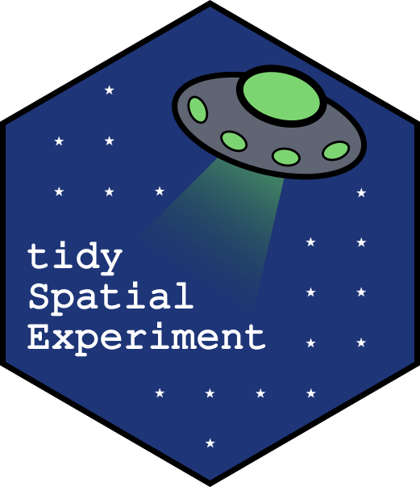

<!-- README.md is generated from README.Rmd. Please edit that file -->

```{r, include=FALSE}
knitr::opts_chunk$set(
    collapse = TRUE,
    comment = "# ",
    fig.path = "man/figures/"
    )
options(tibble.print_min = 5, tibble.print_max = 5)
```

# tidySpatialExperiment - part of *tidyomics* 

<!-- badges: start -->

[](https://www.tidyverse.org/lifecycle/#experimental)
[](https://github.com/william-hutchison/tidySpatialExperiment/actions)

<!-- badges: end -->

```{r child="vignettes/overview.Rmd"}
```
