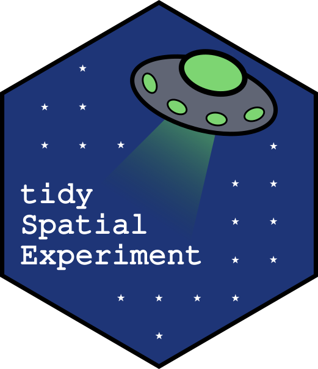
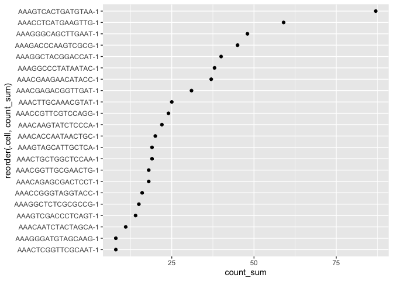
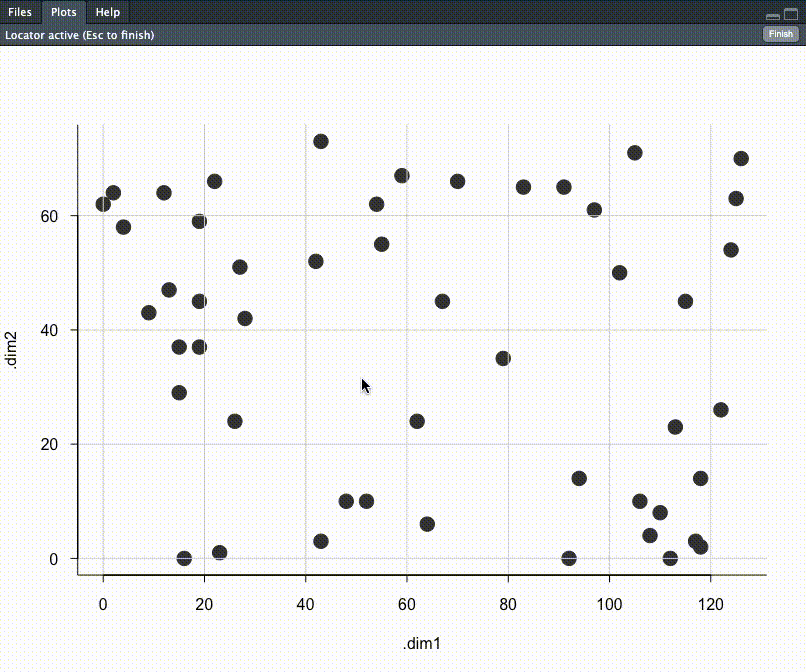

<!-- README.md is generated from README.Rmd. Please edit that file -->

# tidySpatialExperiment - part of *tidyomics* <a ></a>

<!-- badges: start -->

[](https://www.tidyverse.org/lifecycle/#experimental)
<!-- badges: end -->

You can find more packages from the *tidyomics* ecosystem here:

- [tidySingleCellExperiment](https://github.com/stemangiola/tidySingleCellExperiment)
  for tidy manipulation of SingleCellExperiment objects.
- [tidySummarizedExperiment](https://github.com/stemangiola/tidySummarizedExperiment)
  for tidy manipulation of SummarizedExperiment objects.
- [tidyseurat](https://github.com/stemangiola/tidyseurat) for tidy
  manipulation of Seurat objects.
- [tidybulk](https://github.com/stemangiola/tidybulk) for tidy bulk
  RNA-seq data analysis.
- [nanny](https://github.com/stemangiola/nanny) for tidy high-level data
  analysis and manipulation.
- [tidygate](https://github.com/stemangiola/tidygate) for adding custom
  gate information to your tibble.
- [tidyHeatmap](https://github.com/stemangiola/tidyHeatmap) for heatmaps
  produced with tidy principles.

# Introduction

tidySpatialExperiment provides a bridge between the
[SpatialExperiment](https://github.com/drighelli/SpatialExperiment)
\[@righelli2022spatialexperiment\] package and the
[*tidyverse*](https://www.tidyverse.org) \[@wickham2019welcome\]
ecosystem. It creates an invisible layer that allows you to interact
with a SpatialExperiment object as if it were a tibble; enabling the use
of functions from [dplyr](https://github.com/tidyverse/dplyr),
[tidyr](https://github.com/tidyverse/tidyr),
[ggplot2](https://github.com/tidyverse/ggplot2) and
[plotly](https://github.com/plotly/plotly.R). But, underneath, your data
remains a SpatialExperiment object.

tidySpatialExperiment also provides three additional utility functions.

## Functions and utilities

| Package             | Functions available                                                                                                                                                                                                |
|---------------------|--------------------------------------------------------------------------------------------------------------------------------------------------------------------------------------------------------------------|
| `SpatialExperiment` | All                                                                                                                                                                                                                |
| `dplyr`             | `arrange`,`bind_rows`, `bind_cols`, `distinct`, `filter`, `group_by`, `summarise`, `select`, `mutate`, `rename`, `left_join`, `right_join`, `inner_join`, `slice`, `sample_n`, `sample_frac`, `count`, `add_count` |
| `tidyr`             | `nest`, `unnest`, `unite`, `separate`, `extract`, `pivot_longer`                                                                                                                                                   |
| `ggplot2`           | `ggplot`                                                                                                                                                                                                           |
| `plotly`            | `plot_ly`                                                                                                                                                                                                          |

| Utility           | Description                                                               |
|-------------------|---------------------------------------------------------------------------|
| `as_tibble`       | Convert cell-wise information to a `tbl_df`                               |
| `join_features`   | Combine cell-wise and feature-wise information into a `tbl_df`            |
| `aggregate_cells` | Aggregate cell-feature abundance into a pseudobulk `SummarizedExperiment` |

## SpatialExperiment-tibble abstraction

A SpatialExperiment object represents observations (cells) as columns
and variables (features) as rows, as is the Bioconductor convention.
Additional information about the cells is accessed through the
`reducedDims`, `colData` and `spatialCoords` functions.

tidySpatialExperiment provides a SpatialExperiment-tibble abstraction,
representing cells as rows and features as columns, as is the
*tidyverse* convention. `colData` and `spatialCoords` are appended as
columns to the same abstraction, allowing easy interaction with this
additional data.

## Installation

You can install the development version of tidySpatialExperiment from
GitHub with:

``` r
install.packages("devtools")
devtools::install_github("william-hutchison/tidySpatialExperiment")
```

## Load data

Here, we load an example SpatialExperiment object.

``` r
# Load example SpatialExperiment object
library(tidySpatialExperiment)
example(read10xVisium)
```

## View data

The default view is now of the SpatialExperiment-tibble abstraction.

``` r
spe
#  # A SpatialExperiment-tibble abstraction: 99 × 7
#  # Features=50 | Cells=99 | Assays=counts
#    .cell              in_tissue array_row array_col sample_id pxl_col_in_fullres
#    <chr>              <lgl>         <int>     <int> <chr>                  <int>
#  1 AAACAACGAATAGTTC-1 FALSE             0        16 section1                2312
#  2 AAACAAGTATCTCCCA-1 TRUE             50       102 section1                8230
#  3 AAACAATCTACTAGCA-1 TRUE              3        43 section1                4170
#  4 AAACACCAATAACTGC-1 TRUE             59        19 section1                2519
#  5 AAACAGAGCGACTCCT-1 TRUE             14        94 section1                7679
#  # ℹ 94 more rows
#  # ℹ 1 more variable: pxl_row_in_fullres <int>
```

However, our data maintains its status as a SpatialExperiment object.
Therefore, we have access to all SpatialExperiment functions.

``` r
spe |>
  colData() |>
  head()
#  DataFrame with 6 rows and 4 columns
#                     in_tissue array_row array_col   sample_id
#                     <logical> <integer> <integer> <character>
#  AAACAACGAATAGTTC-1     FALSE         0        16    section1
#  AAACAAGTATCTCCCA-1      TRUE        50       102    section1
#  AAACAATCTACTAGCA-1      TRUE         3        43    section1
#  AAACACCAATAACTGC-1      TRUE        59        19    section1
#  AAACAGAGCGACTCCT-1      TRUE        14        94    section1
#  AAACAGCTTTCAGAAG-1     FALSE        43         9    section1

spe |> 
  spatialCoords() |>
  head()
#                     pxl_col_in_fullres pxl_row_in_fullres
#  AAACAACGAATAGTTC-1               2312               1252
#  AAACAAGTATCTCCCA-1               8230               7237
#  AAACAATCTACTAGCA-1               4170               1611
#  AAACACCAATAACTGC-1               2519               8315
#  AAACAGAGCGACTCCT-1               7679               2927
#  AAACAGCTTTCAGAAG-1               1831               6400

spe |>
  imgData()
#  DataFrame with 2 rows and 4 columns
#      sample_id    image_id   data scaleFactor
#    <character> <character> <list>   <numeric>
#  1    section1      lowres   ####   0.0510334
#  2    section2      lowres   ####   0.0510334
```

# Integration with the *tidyverse* ecosystem

## Manipulate with dplyr

Most functions from dplyr are available for use with the
SpatialExperiment-tibble abstraction. For example, `filter` can be used
to select cells by a variable of interest.

``` r
spe |>
  filter(array_col < 5)
#  # A SpatialExperiment-tibble abstraction: 6 × 7
#  # Features=50 | Cells=6 | Assays=counts
#    .cell              in_tissue array_row array_col sample_id pxl_col_in_fullres
#    <chr>              <lgl>         <int>     <int> <chr>                  <int>
#  1 AAACATGGTGAGAGGA-1 FALSE            62         0 section1                1212
#  2 AAACGAAGATGGAGTA-1 FALSE            58         4 section1                1487
#  3 AAAGAATGACCTTAGA-1 FALSE            64         2 section1                1349
#  4 AAACATGGTGAGAGGA-1 FALSE            62         0 section2                1212
#  5 AAACGAAGATGGAGTA-1 FALSE            58         4 section2                1487
#  # ℹ 1 more row
#  # ℹ 1 more variable: pxl_row_in_fullres <int>
```

And `mutate` can be used to add new variables, or modify the value of an
existing variable.

``` r
spe |>
  mutate(in_region = c(in_tissue & array_row < 10))
#  # A SpatialExperiment-tibble abstraction: 99 × 8
#  # Features=50 | Cells=99 | Assays=counts
#    .cell     in_tissue array_row array_col sample_id in_region pxl_col_in_fullres
#    <chr>     <lgl>         <int>     <int> <chr>     <lgl>                  <int>
#  1 AAACAACG… FALSE             0        16 section1  FALSE                   2312
#  2 AAACAAGT… TRUE             50       102 section1  FALSE                   8230
#  3 AAACAATC… TRUE              3        43 section1  TRUE                    4170
#  4 AAACACCA… TRUE             59        19 section1  FALSE                   2519
#  5 AAACAGAG… TRUE             14        94 section1  FALSE                   7679
#  # ℹ 94 more rows
#  # ℹ 1 more variable: pxl_row_in_fullres <int>
```

## Tidy with tidyr

Most functions from tidyr are also available. Here, `nest` is used to
group the data by `sample_id`, and `unnest` is used to ungroup the data.

``` r
# Nest the SpatialExperiment object by sample_id
spe_nested <-
  spe |> 
  nest(data = -sample_id)

# View the nested SpatialExperiment object
spe_nested
#  # A tibble: 2 × 2
#    sample_id data           
#    <chr>     <list>         
#  1 section1  <SptlExpr[,50]>
#  2 section2  <SptlExpr[,49]>

# Unnest the nested SpatialExperiment objects
spe_nested |>
  unnest(data)
#  # A SpatialExperiment-tibble abstraction: 99 × 7
#  # Features=50 | Cells=99 | Assays=counts
#    .cell              in_tissue array_row array_col sample_id pxl_col_in_fullres
#    <chr>              <lgl>         <int>     <int> <chr>                  <int>
#  1 AAACAACGAATAGTTC-1 FALSE             0        16 section1                2312
#  2 AAACAAGTATCTCCCA-1 TRUE             50       102 section1                8230
#  3 AAACAATCTACTAGCA-1 TRUE              3        43 section1                4170
#  4 AAACACCAATAACTGC-1 TRUE             59        19 section1                2519
#  5 AAACAGAGCGACTCCT-1 TRUE             14        94 section1                7679
#  # ℹ 94 more rows
#  # ℹ 1 more variable: pxl_row_in_fullres <int>
```

## Plot with ggplot2

The `ggplot` function can be used to create a plot from a
SpatialExperiment object. This example also demonstrates how tidy
operations can be combined to build up more complex analysis. It should
be noted that helper functions such `aes` are not included and should be
imported from ggplot2.

``` r
spe |>
  filter(sample_id == "section1" & in_tissue) |>
  
  # Add a column with the sum of feature counts per cell
  mutate(count_sum = purrr::map_int(.cell, ~
    spe[, .x] |> 
      counts() |> 
      sum()
    )) |>
  
  # Plot with tidySpatialExperiment and ggplot2
  ggplot(ggplot2::aes(x = reorder(.cell, count_sum), y = count_sum)) +
  ggplot2::geom_point() +
  ggplot2::coord_flip()
```

<!-- -->

## Plot with plotly

The `plot_ly` function can also be used to create a plot from a
SpatialExperiment object.

``` r
spe |>
  filter(sample_id == "section1") |>
  plot_ly(
    x = ~ array_col, 
    y = ~ array_row, 
    color = ~ in_tissue, 
    type = "scatter"
  )
```


# Integration with the *tidyomics* ecosystem

## Interactively select cells with tidygate

Different packages from the *tidyomics* ecosystem are easy to use
together. Here, tidygate is used to interactively gate cells based on
their array location.

``` r
spe_regions <-
  spe |> 
  filter(sample_id == "section1") |>
  mutate(region = tidygate::gate_chr(array_col, array_row))
```



The gated cells can then be divided into pseudobulks within a
SummarizedExperiment object using tidySpatialExperiment’s
`aggregate_cells` utility function.

``` r
spe_regions_aggregated <-
  spe_regions |>
  aggregate_cells(region)
```
# Ellipse and Rectangle Functions

## Ellipse Function

The ellipse function is used to determine if points within a spatial dataset fall within a specified ellipse. 
Usage: `in_ellipse = ellipse(spatial_coord1, spatial_coord2, center, axes_lengths)`

- `spatial_coord1`: X-coordinates of the points.
- `spatial_coord2`: Y-coordinates of the points.
- `center`: A numeric vector specifying the center of the ellipse (x, y).
- `axes_lengths`: A numeric vector specifying the lengths of the semi-major and semi-minor axes of the ellipse.

## Rectangle Function

The rectangle function identifies if points in a spatial dataset are within a specified rectangle.
Usage: `in_rectangle = rectangle(spatial_coord1, spatial_coord2, center, height, width)`

- `spatial_coord1`: X-coordinates of the points.
- `spatial_coord2`: Y-coordinates of the points.
- `center`: A numeric vector specifying the center of the rectangle (x, y).
- `height`: The height of the rectangle.
- `width`: The width of the rectangle.


# Important considerations

## Read-only columns

Removing the `.cell` column will return a tibble. This is consistent
with the behaviour in other *tidyomics* packages.

``` r
spe |>
  select(-.cell) |>
  head()
#  tidySpatialExperiment says: Key columns are missing. A data frame is returned for independent data analysis.
#  # A tibble: 6 × 4
#    in_tissue array_row array_col sample_id
#    <lgl>         <int>     <int> <chr>    
#  1 FALSE             0        16 section1 
#  2 TRUE             50       102 section1 
#  3 TRUE              3        43 section1 
#  4 TRUE             59        19 section1 
#  5 TRUE             14        94 section1 
#  # ℹ 1 more row
```

The sample_id column cannot be removed with *tidyverse* functions, and
can only be modified if the changes are accepted by SpatialExperiment’s
`colData` function.

``` r
# sample_id is not removed, despite the user's request
spe |>
  select(-sample_id)
#  # A SpatialExperiment-tibble abstraction: 99 × 7
#  # Features=50 | Cells=99 | Assays=counts
#    .cell              in_tissue array_row array_col sample_id pxl_col_in_fullres
#    <chr>              <lgl>         <int>     <int> <chr>                  <int>
#  1 AAACAACGAATAGTTC-1 FALSE             0        16 section1                2312
#  2 AAACAAGTATCTCCCA-1 TRUE             50       102 section1                8230
#  3 AAACAATCTACTAGCA-1 TRUE              3        43 section1                4170
#  4 AAACACCAATAACTGC-1 TRUE             59        19 section1                2519
#  5 AAACAGAGCGACTCCT-1 TRUE             14        94 section1                7679
#  # ℹ 94 more rows
#  # ℹ 1 more variable: pxl_row_in_fullres <int>

# This change maintains separation of sample_ids and is permitted
spe |> 
  mutate(sample_id = stringr::str_c(sample_id, "_modified")) |>
  head()
#  # A SpatialExperiment-tibble abstraction: 99 × 7
#  # Features=6 | Cells=99 | Assays=counts
#    .cell              in_tissue array_row array_col sample_id  pxl_col_in_fullres
#    <chr>              <lgl>         <int>     <int> <chr>                   <int>
#  1 AAACAACGAATAGTTC-1 FALSE             0        16 section1_…               2312
#  2 AAACAAGTATCTCCCA-1 TRUE             50       102 section1_…               8230
#  3 AAACAATCTACTAGCA-1 TRUE              3        43 section1_…               4170
#  4 AAACACCAATAACTGC-1 TRUE             59        19 section1_…               2519
#  5 AAACAGAGCGACTCCT-1 TRUE             14        94 section1_…               7679
#  # ℹ 94 more rows
#  # ℹ 1 more variable: pxl_row_in_fullres <int>

# This change does not maintain separation of sample_ids and produces an error
spe |>
  mutate(sample_id = "new_sample")
#  Error in .local(x, ..., value): Number of unique 'sample_id's is 2, but 1 was provided.
```

The `pxl_col_in_fullres` and `px_row_in_fullres` columns cannot be
removed or modified with *tidyverse* functions. This is consistent with
the behaviour of dimension reduction data in other *tidyomics* packages.

``` r
# Attempting to remove pxl_col_in_fullres produces an error
spe |>
  select(-pxl_col_in_fullres)
#  Error in `select_helper()`:
#  ! Can't subset columns that don't exist.
#  ✖ Column `pxl_col_in_fullres` doesn't exist.

# Attempting to modify pxl_col_in_fullres produces an error
spe |> 
  mutate(pxl_col_in_fullres)
#  Error in `dplyr::mutate()`:
#  ℹ In argument: `pxl_col_in_fullres`.
#  Caused by error:
#  ! object 'pxl_col_in_fullres' not found
```
