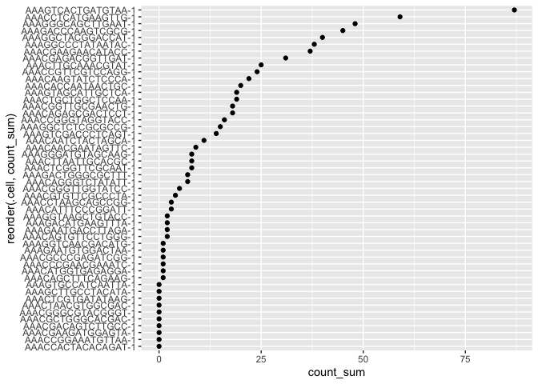
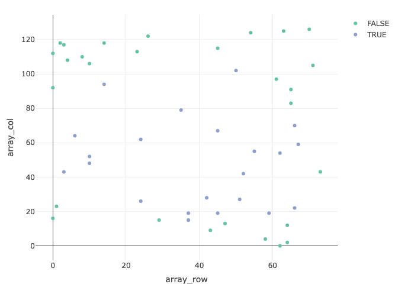

tidySpatialExperiment - part of tidytranscriptomics
================

<!-- README.md is generated from README.Rmd. Please edit that file -->

**Brings SpatialExperiment to the Tidyverse**

<!-- badges: start -->

[](https://www.tidyverse.org/lifecycle/#experimental)
[](https://github.com/william-hutchison/tidySpatialExperiment/actions)
<!-- badges: end -->

You can find more packages from the tidytranscriptomics ecosystem here:

- [tidySingleCellExperiment](https://github.com/stemangiola/tidySingleCellExperiment)
  for tidy manipulation of SingleCellExperiment objects
- [tidySummarizedExperiment](https://github.com/stemangiola/tidySummarizedExperiment)
  for tidy manipulation of SummarizedExperiment objects
- [tidyseurat](https://github.com/stemangiola/tidyseurat) for tidy
  manipulation of Seurat objects
- [tidybulk](https://github.com/stemangiola/tidybulk) for tidy bulk
  RNA-seq data analysis
- [nanny](https://github.com/stemangiola/nanny) for tidy high-level data
  analysis and manipulation
- [tidygate](https://github.com/stemangiola/tidygate) for adding custom
  gate information to your tibble
- [tidyHeatmap](https://github.com/stemangiola/tidyHeatmap) for heatmaps
  produced with tidy principles

# Introduction

tidySpatialExperiment provides a bridge between the
[SpatialExperiment](https://github.com/drighelli/SpatialExperiment)
\[@righelli2022spatialexperiment\] and
[Tidyverse](https://www.tidyverse.org) \[@wickham2019welcome\] packages.
It creates an invisible layer that allows you to interact with a
SpatialExperiment object as if it were a tibble: allowing the use of
*dplyr*, *tidyr*, *ggplot2* and *plotly* functions. But, underneath,
your data remains a SpatialExperiment object.

tidySpatialExperiment also provides two additional utility functions.

## Functions and utilities

| Package             | Functions available                                                                                                                                                                                                |
|---------------------|--------------------------------------------------------------------------------------------------------------------------------------------------------------------------------------------------------------------|
| `SpatialExperiment` | All                                                                                                                                                                                                                |
| `dplyr`             | `arrange`,`bind_rows`, `bind_cols`, `distinct`, `filter`, `group_by`, `summarise`, `select`, `mutate`, `rename`, `left_join`, `right_join`, `inner_join`, `slice`, `sample_n`, `sample_frac`, `count`, `add_count` |
| `tidyr`             | `nest`, `unnest`, `unite`, `separate`, `extract`, `pivot_longer`                                                                                                                                                   |
| `ggplot2`           | `ggplot`                                                                                                                                                                                                           |
| `plotly`            | `plot_ly`                                                                                                                                                                                                          |

| Utility           | Description                                                      |
|-------------------|------------------------------------------------------------------|
| `as_tibble`       | Convert cell-wise information to a `tbl_df`                      |
| `aggregate_cells` | Aggregate cell gene-transcription abundance as pseudobulk tissue |

## SpatialExperiment-tibble abstraction

A SpatialExperiment object represents cells as columns and features as
rows, as is the Bioconductor convention. Additional information about
the cells is accessed through the `reducedDims`, `colData` and
`spatialCoords` functions.

tidySpatialExperiment provides a SpatialExperiment-tibble abstraction,
representing cells (observations) as rows and features (variables) as
columns, as is the Tidyverse convention. In addition, `colData` and
`spatialCoords` are appended as columns to the same abstraction,
allowing easy interaction with this additional data.

## Installation

You can install the development version of tidySpatialExperiment from
GitHub with:

    install.packages("devtools")
    devtools::install_github("william-hutchison/tidySpatialExperiment")

# Examples

## Load data

Here, we load and view an example SpatialExperiment object. The output
we see is of the SpatialExperiment-tibble abstraction.

``` r
# Load example SpatialExperiment object
library(tidySpatialExperiment)
example(read10xVisium)
```

``` r
# View the SpatialExperiment-tibble abstraction
spe
```

    ## # A SpatialExperiment-tibble abstraction: 99 × 7
    ## # Features=50 | Cells=99 | Assays=counts
    ##    .cell              in_tissue array_row array_col sample_id pxl_col_in_fullres
    ##    <chr>              <lgl>         <int>     <int> <chr>                  <int>
    ##  1 AAACAACGAATAGTTC-1 FALSE             0        16 section1                2312
    ##  2 AAACAAGTATCTCCCA-1 TRUE             50       102 section1                8230
    ##  3 AAACAATCTACTAGCA-1 TRUE              3        43 section1                4170
    ##  4 AAACACCAATAACTGC-1 TRUE             59        19 section1                2519
    ##  5 AAACAGAGCGACTCCT-1 TRUE             14        94 section1                7679
    ##  6 AAACAGCTTTCAGAAG-1 FALSE            43         9 section1                1831
    ##  7 AAACAGGGTCTATATT-1 FALSE            47        13 section1                2106
    ##  8 AAACAGTGTTCCTGGG-1 FALSE            73        43 section1                4170
    ##  9 AAACATGGTGAGAGGA-1 FALSE            62         0 section1                1212
    ## 10 AAACATTTCCCGGATT-1 FALSE            61        97 section1                7886
    ## # ℹ 89 more rows
    ## # ℹ 1 more variable: pxl_row_in_fullres <int>

However, our object is still a SpatialExperiment object. Therefore, we
have access to all SpatialExperiment functions.

``` r
spe |>
  colData() |>
  head()
```

    ## DataFrame with 6 rows and 4 columns
    ##                    in_tissue array_row array_col   sample_id
    ##                    <logical> <integer> <integer> <character>
    ## AAACAACGAATAGTTC-1     FALSE         0        16    section1
    ## AAACAAGTATCTCCCA-1      TRUE        50       102    section1
    ## AAACAATCTACTAGCA-1      TRUE         3        43    section1
    ## AAACACCAATAACTGC-1      TRUE        59        19    section1
    ## AAACAGAGCGACTCCT-1      TRUE        14        94    section1
    ## AAACAGCTTTCAGAAG-1     FALSE        43         9    section1

``` r
spe |> 
  spatialCoords() |>
  head()
```

    ##                    pxl_col_in_fullres pxl_row_in_fullres
    ## AAACAACGAATAGTTC-1               2312               1252
    ## AAACAAGTATCTCCCA-1               8230               7237
    ## AAACAATCTACTAGCA-1               4170               1611
    ## AAACACCAATAACTGC-1               2519               8315
    ## AAACAGAGCGACTCCT-1               7679               2927
    ## AAACAGCTTTCAGAAG-1               1831               6400

``` r
spe |>
  imgData()
```

    ## DataFrame with 2 rows and 4 columns
    ##     sample_id    image_id   data scaleFactor
    ##   <character> <character> <list>   <numeric>
    ## 1    section1      lowres   ####   0.0510334
    ## 2    section2      lowres   ####   0.0510334

## Manipulate with dplyr

Most functions from *dplyr* are available for use with the
SpatialExperiment-tibble abstraction. For example, `filter` can be used
to select cells by a variable of interest.

``` r
spe |>
  filter(array_col < 5)
```

    ## # A SpatialExperiment-tibble abstraction: 6 × 7
    ## # Features=50 | Cells=6 | Assays=counts
    ##   .cell              in_tissue array_row array_col sample_id pxl_col_in_fullres
    ##   <chr>              <lgl>         <int>     <int> <chr>                  <int>
    ## 1 AAACATGGTGAGAGGA-1 FALSE            62         0 section1                1212
    ## 2 AAACGAAGATGGAGTA-1 FALSE            58         4 section1                1487
    ## 3 AAAGAATGACCTTAGA-1 FALSE            64         2 section1                1349
    ## 4 AAACATGGTGAGAGGA-1 FALSE            62         0 section2                1212
    ## 5 AAACGAAGATGGAGTA-1 FALSE            58         4 section2                1487
    ## 6 AAAGAATGACCTTAGA-1 FALSE            64         2 section2                1349
    ## # ℹ 1 more variable: pxl_row_in_fullres <int>

And `mutate` can be used to add new variables, or modify the value of an
existing variable.

``` r
spe |>
  mutate(in_region = c(in_tissue & array_row < 10))
```

    ## # A SpatialExperiment-tibble abstraction: 99 × 8
    ## # Features=50 | Cells=99 | Assays=counts
    ##    .cell    in_tissue array_row array_col sample_id in_region pxl_col_in_fullres
    ##    <chr>    <lgl>         <int>     <int> <chr>     <lgl>                  <int>
    ##  1 AAACAAC… FALSE             0        16 section1  FALSE                   2312
    ##  2 AAACAAG… TRUE             50       102 section1  FALSE                   8230
    ##  3 AAACAAT… TRUE              3        43 section1  TRUE                    4170
    ##  4 AAACACC… TRUE             59        19 section1  FALSE                   2519
    ##  5 AAACAGA… TRUE             14        94 section1  FALSE                   7679
    ##  6 AAACAGC… FALSE            43         9 section1  FALSE                   1831
    ##  7 AAACAGG… FALSE            47        13 section1  FALSE                   2106
    ##  8 AAACAGT… FALSE            73        43 section1  FALSE                   4170
    ##  9 AAACATG… FALSE            62         0 section1  FALSE                   1212
    ## 10 AAACATT… FALSE            61        97 section1  FALSE                   7886
    ## # ℹ 89 more rows
    ## # ℹ 1 more variable: pxl_row_in_fullres <int>

## Tidy with tidyr

Most functions from *tidyr* are also available. Here, `nest` is used to
group the data by sample_id, and `unnest` is used to ungroup the data.

``` r
# Nest the SpatialExperiment object by sample_id
spe_nested <-
  spe |> 
  nest(data = -sample_id)

# View the nested SpatialExperiment object
spe_nested
```

    ## # A tibble: 2 × 2
    ##   sample_id data           
    ##   <chr>     <list>         
    ## 1 section1  <SptlExpr[,50]>
    ## 2 section2  <SptlExpr[,49]>

``` r
# Unnest the nested SpatialExperiment objects
spe_nested |>
  unnest(data)
```

    ## # A SpatialExperiment-tibble abstraction: 99 × 7
    ## # Features=50 | Cells=99 | Assays=counts
    ##    .cell              in_tissue array_row array_col sample_id pxl_col_in_fullres
    ##    <chr>              <lgl>         <int>     <int> <chr>                  <int>
    ##  1 AAACAACGAATAGTTC-1 FALSE             0        16 section1                2312
    ##  2 AAACAAGTATCTCCCA-1 TRUE             50       102 section1                8230
    ##  3 AAACAATCTACTAGCA-1 TRUE              3        43 section1                4170
    ##  4 AAACACCAATAACTGC-1 TRUE             59        19 section1                2519
    ##  5 AAACAGAGCGACTCCT-1 TRUE             14        94 section1                7679
    ##  6 AAACAGCTTTCAGAAG-1 FALSE            43         9 section1                1831
    ##  7 AAACAGGGTCTATATT-1 FALSE            47        13 section1                2106
    ##  8 AAACAGTGTTCCTGGG-1 FALSE            73        43 section1                4170
    ##  9 AAACATGGTGAGAGGA-1 FALSE            62         0 section1                1212
    ## 10 AAACATTTCCCGGATT-1 FALSE            61        97 section1                7886
    ## # ℹ 89 more rows
    ## # ℹ 1 more variable: pxl_row_in_fullres <int>

## Plot with ggplot2

The `ggplot` function can be used to create a plot from a
SpatialExperiment object. This example also demonstrates how tidy
operations can be combined to build up more complex analysis. It should
be noted that helper functions such `aes` are not included and should be
imported from *ggplot2*.

``` r
spe |>
  filter(sample_id == "section1") |>
  
  # Add a column with the sum of feature counts per cell
  mutate(count_sum = purrr::map_int(.cell, ~
    spe[, .x] |> 
      counts() |> 
      sum()
    )) |>
  
  # Plot with tidySpatialExperiment and ggplot2
  ggplot(ggplot2::aes(x = reorder(.cell, count_sum), y = count_sum)) +
  ggplot2::geom_point() +
  ggplot2::coord_flip()
```

<!-- -->

## Plot with plotly

The `plot_ly` function can also be used to create a plot from a
SpatialExperiment object.

``` r
spe |>
  filter(sample_id == "section1") |>
  plot_ly(
    x = ~ array_row, 
    y = ~ array_col, 
    color = ~ in_tissue, 
    type = "scatter"
  )
```

    ## No scatter mode specifed:
    ##   Setting the mode to markers
    ##   Read more about this attribute -> https://plotly.com/r/reference/#scatter-mode

    ## Warning in RColorBrewer::brewer.pal(N, "Set2"): minimal value for n is 3, returning requested palette with 3 different levels

    ## Warning in RColorBrewer::brewer.pal(N, "Set2"): minimal value for n is 3, returning requested palette with 3 different levels

<!-- -->

# Important considerations

tidySpatialExperiment is still in development and contains some rough
edges. Below are examples of behaviour that is currently unclear. I will
be adding warning messages / making changes to address these problems in
the coming weeks.

## Read-only columns

Removing the .cell column will return a tibble. This is consistent with
the behaviour in other tidytranscriptomics packages.

``` r
spe |>
  select(-.cell) |>
  head()
```

    ## tidySpatialExperiment says: Key columns are missing. A data frame is returned for independent data analysis.

    ## # A tibble: 6 × 4
    ##   in_tissue array_row array_col sample_id
    ##   <lgl>         <int>     <int> <chr>    
    ## 1 FALSE             0        16 section1 
    ## 2 TRUE             50       102 section1 
    ## 3 TRUE              3        43 section1 
    ## 4 TRUE             59        19 section1 
    ## 5 TRUE             14        94 section1 
    ## 6 FALSE            43         9 section1

The sample_id column cannot be removed with tidyverse functions, and can
only be modified if the changes are accepted by SpatialExperiment’s
`colData` function.

``` r
# sample_id is not removed, despite the user's request
spe |>
  select(-sample_id)
```

    ## # A SpatialExperiment-tibble abstraction: 99 × 7
    ## # Features=50 | Cells=99 | Assays=counts
    ##    .cell              in_tissue array_row array_col sample_id pxl_col_in_fullres
    ##    <chr>              <lgl>         <int>     <int> <chr>                  <int>
    ##  1 AAACAACGAATAGTTC-1 FALSE             0        16 section1                2312
    ##  2 AAACAAGTATCTCCCA-1 TRUE             50       102 section1                8230
    ##  3 AAACAATCTACTAGCA-1 TRUE              3        43 section1                4170
    ##  4 AAACACCAATAACTGC-1 TRUE             59        19 section1                2519
    ##  5 AAACAGAGCGACTCCT-1 TRUE             14        94 section1                7679
    ##  6 AAACAGCTTTCAGAAG-1 FALSE            43         9 section1                1831
    ##  7 AAACAGGGTCTATATT-1 FALSE            47        13 section1                2106
    ##  8 AAACAGTGTTCCTGGG-1 FALSE            73        43 section1                4170
    ##  9 AAACATGGTGAGAGGA-1 FALSE            62         0 section1                1212
    ## 10 AAACATTTCCCGGATT-1 FALSE            61        97 section1                7886
    ## # ℹ 89 more rows
    ## # ℹ 1 more variable: pxl_row_in_fullres <int>

``` r
# This change maintains separation of sample_ids and is permitted
spe |> 
  mutate(sample_id = stringr::str_c(sample_id, "_modified")) |>
  head()
```

    ## # A SpatialExperiment-tibble abstraction: 99 × 7
    ## # Features=6 | Cells=99 | Assays=counts
    ##    .cell              in_tissue array_row array_col sample_id pxl_col_in_fullres
    ##    <chr>              <lgl>         <int>     <int> <chr>                  <int>
    ##  1 AAACAACGAATAGTTC-1 FALSE             0        16 section1…               2312
    ##  2 AAACAAGTATCTCCCA-1 TRUE             50       102 section1…               8230
    ##  3 AAACAATCTACTAGCA-1 TRUE              3        43 section1…               4170
    ##  4 AAACACCAATAACTGC-1 TRUE             59        19 section1…               2519
    ##  5 AAACAGAGCGACTCCT-1 TRUE             14        94 section1…               7679
    ##  6 AAACAGCTTTCAGAAG-1 FALSE            43         9 section1…               1831
    ##  7 AAACAGGGTCTATATT-1 FALSE            47        13 section1…               2106
    ##  8 AAACAGTGTTCCTGGG-1 FALSE            73        43 section1…               4170
    ##  9 AAACATGGTGAGAGGA-1 FALSE            62         0 section1…               1212
    ## 10 AAACATTTCCCGGATT-1 FALSE            61        97 section1…               7886
    ## # ℹ 89 more rows
    ## # ℹ 1 more variable: pxl_row_in_fullres <int>

``` r
# This change does not maintain separation of sample_ids and produces an error
spe |>
  mutate(sample_id = "new_sample")
```

    ## Error in .local(x, ..., value): Number of unique 'sample_id's is 2, but 1 was provided.

The pxl_col_in_fullres and px_row_in_fullres columns cannot be removed
or modified with tidyverse functions. This is consistent with the
behaviour of dimension reduction data in other tidytranscriptomics
packages.

``` r
# Attempting to remove pxl_col_in_fullres produces an error
spe |>
  select(-pxl_col_in_fullres)
```

    ## Error in `select_helper()`:
    ## ! Can't subset columns that don't exist.
    ## ✖ Column `pxl_col_in_fullres` doesn't exist.

``` r
# Attempting to modify pxl_col_in_fullres produces an error
spe |> 
  mutate(pxl_col_in_fullres)
```

    ## Error in `dplyr::mutate()`:
    ## ℹ In argument: `pxl_col_in_fullres`.
    ## Caused by error:
    ## ! object 'pxl_col_in_fullres' not found

## Unnesting

tidySpatialExperiment’s unnest works through cbind. cbind seems to
assume the objects it is joining cannot be from the same sample.
Therefore, cbind appends indices to the sample_id values if there are
any duplicates across the objects to keep them separate. Because of
this, nesting and unnesting on anything other than the sample_id will
cause the sample_id value to have indices appended. This behaviour is
desirable if the samples truly are different, but not if they are the
same.

``` r
# Using cbind
cbind(spe[, colData(spe)$in_tissue], spe[, !colData(spe)$in_tissue])
```

    ## 'sample_id's are duplicated across 'SpatialExperiment' objects to cbind; appending sample indices.

    ## # A SpatialExperiment-tibble abstraction: 99 × 7
    ## # Features=50 | Cells=99 | Assays=counts
    ##    .cell              in_tissue array_row array_col sample_id pxl_col_in_fullres
    ##    <chr>              <lgl>         <int>     <int> <chr>                  <int>
    ##  1 AAACAAGTATCTCCCA-1 TRUE             50       102 section1…               8230
    ##  2 AAACAATCTACTAGCA-1 TRUE              3        43 section1…               4170
    ##  3 AAACACCAATAACTGC-1 TRUE             59        19 section1…               2519
    ##  4 AAACAGAGCGACTCCT-1 TRUE             14        94 section1…               7679
    ##  5 AAACCGGGTAGGTACC-1 TRUE             42        28 section1…               3138
    ##  6 AAACCGTTCGTCCAGG-1 TRUE             52        42 section1…               4101
    ##  7 AAACCTCATGAAGTTG-1 TRUE             37        19 section1…               2519
    ##  8 AAACGAAGAACATACC-1 TRUE              6        64 section1…               5615
    ##  9 AAACGAGACGGTTGAT-1 TRUE             35        79 section1…               6647
    ## 10 AAACGGTTGCGAACTG-1 TRUE             67        59 section1…               5271
    ## # ℹ 89 more rows
    ## # ℹ 1 more variable: pxl_row_in_fullres <int>

``` r
# Using unnest
spe |>
  nest(data = -in_tissue) |>
  unnest(data)
```

    ## 'sample_id's are duplicated across 'SpatialExperiment' objects to cbind; appending sample indices.

    ## # A SpatialExperiment-tibble abstraction: 99 × 7
    ## # Features=50 | Cells=99 | Assays=counts
    ##    .cell              in_tissue array_row array_col sample_id pxl_col_in_fullres
    ##    <chr>              <lgl>         <int>     <int> <chr>                  <int>
    ##  1 AAACAACGAATAGTTC-1 FALSE             0        16 section1…               2312
    ##  2 AAACAGCTTTCAGAAG-1 FALSE            43         9 section1…               1831
    ##  3 AAACAGGGTCTATATT-1 FALSE            47        13 section1…               2106
    ##  4 AAACAGTGTTCCTGGG-1 FALSE            73        43 section1…               4170
    ##  5 AAACATGGTGAGAGGA-1 FALSE            62         0 section1…               1212
    ##  6 AAACATTTCCCGGATT-1 FALSE            61        97 section1…               7886
    ##  7 AAACCACTACACAGAT-1 FALSE             3       117 section1…               9261
    ##  8 AAACCCGAACGAAATC-1 FALSE            45       115 section1…               9124
    ##  9 AAACCGGAAATGTTAA-1 FALSE            54       124 section1…               9743
    ## 10 AAACCTAAGCAGCCGG-1 FALSE            65        83 section1…               6922
    ## # ℹ 89 more rows
    ## # ℹ 1 more variable: pxl_row_in_fullres <int>
