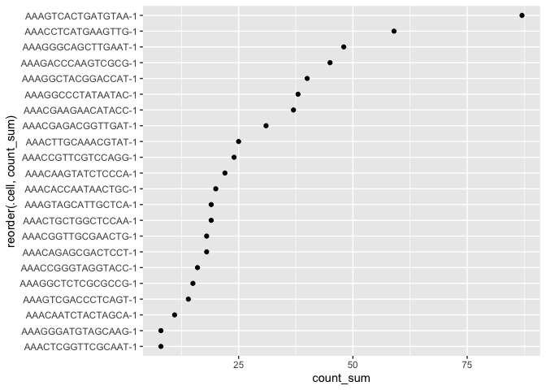
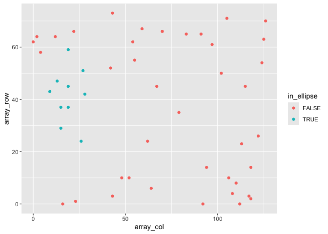

<!-- README.md is generated from README.Rmd. Please edit that file -->

# tidySpatialExperiment - part of *tidyomics* 

<!-- badges: start -->

[](https://www.tidyverse.org/lifecycle/#experimental)
[](https://github.com/william-hutchison/tidySpatialExperiment/actions)

<!-- badges: end -->

# Introduction

tidySpatialExperiment provides a bridge between the
[SpatialExperiment](https://github.com/drighelli/SpatialExperiment)
package and the [*tidyverse*](https://www.tidyverse.org) ecosystem. It
creates an invisible layer that allows you to interact with a
`SpatialExperiment` object as if it were a tibble; enabling the use of
functions from [dplyr](https://github.com/tidyverse/dplyr),
[tidyr](https://github.com/tidyverse/tidyr),
[ggplot2](https://github.com/tidyverse/ggplot2) and
[plotly](https://github.com/plotly/plotly.R). But, underneath, your data
remains a `SpatialExperiment` object.

tidySpatialExperiment also provides five additional utility functions.

## Resources

If you would like to learn more about tidySpatialExperiment and
*tidyomics*, the following links are a good place to start:

- [The tidySpatialExperiment
  website](http://william-hutchison.github.io/tidySpatialExperiment/)
- [The tidyomics website](https://github.com/tidyomics)

The *tidyomics* ecosystem also includes packages for:

- Working with genomic features:

  - [plyranges](https://github.com/sa-lee/plyranges), for tidy
    manipulation of genomic range data.
  - [nullranges](https://github.com/nullranges/nullranges), for tidy
    generation of genomic ranges representing the null hypothesis.
  - [plyinteractions](https://github.com/tidyomics/plyinteractions), for
    tidy manipulation of genomic interaction data.

- Working with transcriptomic features:

  - [tidySummarizedExperiment](https://github.com/stemangiola/tidySummarizedExperiment),
    for tidy manipulation of `SummarizedExperiment` objects.
  - [tidySingleCellExperiment](https://github.com/stemangiola/tidySingleCellExperiment),
    for tidy manipulation of `SingleCellExperiment` objects.
  - [tidyseurat](https://github.com/stemangiola/tidyseurat), for tidy
    manipulation of `Seurat` objects.
  - [tidybulk](https://github.com/stemangiola/tidybulk), for bulk
    RNA-seq analysis.

- Working with cytometry features:

  - [tidytof](https://github.com/keyes-timothy/tidytof), for tidy
    manipulation of high-dimensional cytometry data.

- And a few associated packages:

  - [tidygate](https://github.com/stemangiola/tidygate), for manual
    gating of points in space.
  - [tidyheatmap](https://github.com/stemangiola/tidyHeatmap/), for
    modular heatmap contruction.

## Functions and utilities

| Package             | Functions available                                                                                                                                                                                                |
|---------------------|--------------------------------------------------------------------------------------------------------------------------------------------------------------------------------------------------------------------|
| `SpatialExperiment` | All                                                                                                                                                                                                                |
| `dplyr`             | `arrange`,`bind_rows`, `bind_cols`, `distinct`, `filter`, `group_by`, `summarise`, `select`, `mutate`, `rename`, `left_join`, `right_join`, `inner_join`, `slice`, `sample_n`, `sample_frac`, `count`, `add_count` |
| `tidyr`             | `nest`, `unnest`, `unite`, `separate`, `extract`, `pivot_longer`                                                                                                                                                   |
| `ggplot2`           | `ggplot`                                                                                                                                                                                                           |
| `plotly`            | `plot_ly`                                                                                                                                                                                                          |

| Utility             | Description                                                                      |
|---------------------|----------------------------------------------------------------------------------|
| `as_tibble`         | Convert cell data to a `tbl_df`                                                  |
| `join_features`     | Append feature data to cell data                                                 |
| `aggregate_cells`   | Aggregate cell-feature abundance into a pseudobulk `SummarizedExperiment` object |
| `rectangle`         | Select cells in a rectangular region of space                                    |
| `ellipse`           | Select cells in an elliptical region of space                                    |
| `gate_spatial`      |                                                                                  |
| `gate_programmatic` |                                                                                  |

## Installation

You can install the stable version of tidySpatialExperiment from
Bioconductor.

``` r
if (!requireNamespace("BiocManager", quietly = TRUE))
    install.packages("BiocManager")

BiocManager::install("tidySpatialExperiment")
```

Or, you can install the development version of tidySpatialExperiment
from GitHub.

``` r
if (!requireNamespace("pak", quietly = TRUE))
    install.packages("pak")

pak::pak("william-hutchison/tidySpatialExperiment")
```

## Load data

Here, we attach tidySpatialExperiment and an example `SpatialExperiment`
object.

``` r
# Load example SpatialExperiment object
library(tidySpatialExperiment)
example(read10xVisium)
```

## SpatialExperiment-tibble abstraction

A `SpatialExperiment` object represents assay-feature values as rows and
cells as columns. Additional information about the cells is stored in
the `reducedDims`, `colData` and `spatialCoords` slots.

tidySpatialExperiment provides a SpatialExperiment-tibble abstraction,
representing cells as rows and cell data as columns, in accordance with
the tidy observation-variable convention. The cell data is made up of
information stored in the `colData` and `spatialCoords` slots.

The default view is now of the SpatialExperiment-tibble abstraction.

``` r
spe
#  # A SpatialExperiment-tibble abstraction: 50 × 7
#  # Features = 50 | Cells = 50 | Assays = counts
#    .cell              in_tissue array_row array_col sample_id pxl_col_in_fullres
#    <chr>              <lgl>         <int>     <int> <chr>                  <int>
#  1 AAACAACGAATAGTTC-1 FALSE             0        16 section1                2312
#  2 AAACAAGTATCTCCCA-1 TRUE             50       102 section1                8230
#  3 AAACAATCTACTAGCA-1 TRUE              3        43 section1                4170
#  4 AAACACCAATAACTGC-1 TRUE             59        19 section1                2519
#  5 AAACAGAGCGACTCCT-1 TRUE             14        94 section1                7679
#  # ℹ 45 more rows
#  # ℹ 1 more variable: pxl_row_in_fullres <int>
```

But, our data maintains its status as a `SpatialExperiment` object.
Therefore, we have access to all `SpatialExperiment` functions.

``` r
spe |>
    colData() |>
    head()
#  DataFrame with 6 rows and 4 columns
#                     in_tissue array_row array_col   sample_id
#                     <logical> <integer> <integer> <character>
#  AAACAACGAATAGTTC-1     FALSE         0        16    section1
#  AAACAAGTATCTCCCA-1      TRUE        50       102    section1
#  AAACAATCTACTAGCA-1      TRUE         3        43    section1
#  AAACACCAATAACTGC-1      TRUE        59        19    section1
#  AAACAGAGCGACTCCT-1      TRUE        14        94    section1
#  AAACAGCTTTCAGAAG-1     FALSE        43         9    section1

spe |> 
    spatialCoords() |>
    head()
#                     pxl_col_in_fullres pxl_row_in_fullres
#  AAACAACGAATAGTTC-1               2312               1252
#  AAACAAGTATCTCCCA-1               8230               7237
#  AAACAATCTACTAGCA-1               4170               1611
#  AAACACCAATAACTGC-1               2519               8315
#  AAACAGAGCGACTCCT-1               7679               2927
#  AAACAGCTTTCAGAAG-1               1831               6400

spe |>
    imgData()
#  DataFrame with 1 row and 4 columns
#      sample_id    image_id   data scaleFactor
#    <character> <character> <list>   <numeric>
#  1    section1      lowres   ####   0.0510334
```

# Integration with the *tidyverse* ecosystem

## Manipulate with dplyr

Most functions from dplyr are available for use with the
SpatialExperiment-tibble abstraction. For example, `filter()` can be
used to filter cells by a variable of interest.

``` r
spe |>
   filter(array_col < 5)
#  # A SpatialExperiment-tibble abstraction: 3 × 7
#  # Features = 50 | Cells = 3 | Assays = counts
#    .cell              in_tissue array_row array_col sample_id pxl_col_in_fullres
#    <chr>              <lgl>         <int>     <int> <chr>                  <int>
#  1 AAACATGGTGAGAGGA-1 FALSE            62         0 section1                1212
#  2 AAACGAAGATGGAGTA-1 FALSE            58         4 section1                1487
#  3 AAAGAATGACCTTAGA-1 FALSE            64         2 section1                1349
#  # ℹ 1 more variable: pxl_row_in_fullres <int>
```

And `mutate` can be used to add new variables, or modify the value of an
existing variable.

``` r
spe |>
    mutate(in_region = c(in_tissue & array_row < 10))
#  # A SpatialExperiment-tibble abstraction: 50 × 8
#  # Features = 50 | Cells = 50 | Assays = counts
#    .cell     in_tissue array_row array_col sample_id in_region pxl_col_in_fullres
#    <chr>     <lgl>         <int>     <int> <chr>     <lgl>                  <int>
#  1 AAACAACG… FALSE             0        16 section1  FALSE                   2312
#  2 AAACAAGT… TRUE             50       102 section1  FALSE                   8230
#  3 AAACAATC… TRUE              3        43 section1  TRUE                    4170
#  4 AAACACCA… TRUE             59        19 section1  FALSE                   2519
#  5 AAACAGAG… TRUE             14        94 section1  FALSE                   7679
#  # ℹ 45 more rows
#  # ℹ 1 more variable: pxl_row_in_fullres <int>
```

## Tidy with tidyr

Most functions from tidyr are also available. Here, `nest()` is used to
group the data by `sample_id`, and `unnest()` is used to ungroup the
data.

``` r
# Nest the SpatialExperiment object by sample_id
spe_nested <-
    spe |> 
    nest(data = -sample_id)

# View the nested SpatialExperiment object
spe_nested
#  # A tibble: 1 × 2
#    sample_id data           
#    <chr>     <list>         
#  1 section1  <SptlExpr[,50]>

# Unnest the nested SpatialExperiment objects
spe_nested |>
    unnest(data)
#  # A SpatialExperiment-tibble abstraction: 50 × 7
#  # Features = 50 | Cells = 50 | Assays = counts
#    .cell              in_tissue array_row array_col sample_id pxl_col_in_fullres
#    <chr>              <lgl>         <int>     <int> <chr>                  <int>
#  1 AAACAACGAATAGTTC-1 FALSE             0        16 section1                2312
#  2 AAACAAGTATCTCCCA-1 TRUE             50       102 section1                8230
#  3 AAACAATCTACTAGCA-1 TRUE              3        43 section1                4170
#  4 AAACACCAATAACTGC-1 TRUE             59        19 section1                2519
#  5 AAACAGAGCGACTCCT-1 TRUE             14        94 section1                7679
#  # ℹ 45 more rows
#  # ℹ 1 more variable: pxl_row_in_fullres <int>
```

## Plot with ggplot2

The `ggplot()` function can be used to create a plot directly from a
`SpatialExperiment` object. This example also demonstrates how tidy
operations can be combined to build up more complex analysis.

``` r
spe |>
    filter(sample_id == "section1" & in_tissue) |>
    
    # Add a column with the sum of feature counts per cell
    mutate(count_sum = purrr::map_int(.cell, ~
        spe[, .x] |> 
            counts() |> 
            sum()
      )) |>
    
    # Plot with tidySpatialExperiment and ggplot2
    ggplot(aes(x = reorder(.cell, count_sum), y = count_sum)) +
    geom_point() +
    coord_flip()
```

<!-- -->

## Plot with plotly

The `plot_ly()` function can also be used to create a plot from a
`SpatialExperiment` object.

``` r
spe |>
    filter(sample_id == "section1") |>
    plot_ly(
        x = ~ array_col, 
        y = ~ array_row, 
        color = ~ in_tissue, 
        type = "scatter"
    )
```


# Utilities

## Append feature data to cell data

The *tidyomics* ecosystem places an emphasis on interacting with cell
data. To interact with feature data, the `join_features()` function can
be used to append assay-feature values to cell data.

``` r
# Join feature data in wide format, preserving the SpatialExperiment object
spe |>
    join_features(features = c("ENSMUSG00000025915", "ENSMUSG00000042501"), shape = "wide") |> 
    head()
#  # A SpatialExperiment-tibble abstraction: 50 × 9
#  # Features = 6 | Cells = 50 | Assays = counts
#    .cell              in_tissue array_row array_col sample_id ENSMUSG00000025915
#    <chr>              <lgl>         <int>     <int> <chr>                  <dbl>
#  1 AAACAACGAATAGTTC-1 FALSE             0        16 section1                   0
#  2 AAACAAGTATCTCCCA-1 TRUE             50       102 section1                   0
#  3 AAACAATCTACTAGCA-1 TRUE              3        43 section1                   0
#  4 AAACACCAATAACTGC-1 TRUE             59        19 section1                   0
#  5 AAACAGAGCGACTCCT-1 TRUE             14        94 section1                   0
#  # ℹ 45 more rows
#  # ℹ 3 more variables: ENSMUSG00000042501 <dbl>, pxl_col_in_fullres <int>,
#  #   pxl_row_in_fullres <int>

# Join feature data in long format, discarding the SpatialExperiment object
spe |>
    join_features(features = c("ENSMUSG00000025915", "ENSMUSG00000042501"), shape = "long") |> 
    head()
#  tidySpatialExperiment says: A data frame is returned for independent data 
#                analysis.
#  # A tibble: 6 × 7
#    .cell       in_tissue array_row array_col sample_id .feature .abundance_counts
#    <chr>       <lgl>         <int>     <int> <chr>     <chr>                <dbl>
#  1 AAACAACGAA… FALSE             0        16 section1  ENSMUSG…                 0
#  2 AAACAACGAA… FALSE             0        16 section1  ENSMUSG…                 0
#  3 AAACAAGTAT… TRUE             50       102 section1  ENSMUSG…                 0
#  4 AAACAAGTAT… TRUE             50       102 section1  ENSMUSG…                 1
#  5 AAACAATCTA… TRUE              3        43 section1  ENSMUSG…                 0
#  # ℹ 1 more row
```

## Aggregate cells

Sometimes, it is necessary to aggregate the gene-transcript abundance
from a group of cells into a single value. For example, when comparing
groups of cells across different samples with fixed-effect models.

The `aggregate_cells()` function can be used to aggregate cells by a
specified variable and assay, returning a `SummarizedExperiment` object.

``` r
spe |>
    aggregate_cells(in_tissue, assays = "counts")
#  class: SummarizedExperiment 
#  dim: 50 2 
#  metadata(0):
#  assays(1): counts
#  rownames(50): ENSMUSG00000002459 ENSMUSG00000005886 ...
#    ENSMUSG00000104217 ENSMUSG00000104328
#  rowData names(1): feature
#  colnames(2): FALSE TRUE
#  colData names(3): in_tissue .aggregated_cells sample_id
```

## Elliptical and rectangular region selection

The `ellipse()` and `rectangle()` functions can be used to select cells
by their position in space.

``` r
spe |>
    filter(sample_id == "section1") |>
    mutate(in_ellipse = ellipse(array_col, array_row, c(20, 40), c(20, 20))) |>
    ggplot(aes(x = array_col, y = array_row, colour = in_ellipse)) +
    geom_point()
```

<!-- -->

## Interactive gating

For the interactive selection of cells in space, tidySpatialExperiment
experiment provides `gate()`. This function uses
[tidygate](https://github.com/stemangiola/tidygate), shiny and plotly to
launch an interactive plot overlaying cells in position with image data.
Additional parameters can be used to specify point colour, shape, size
and alpha, either with a column in the SpatialExperiment object or a
constant value.

``` r
spe_gated <- 
  spe |>
  gate(colour = "in_tissue", alpha = 0.8)
```


A record of which points appear in which gates is appended to the
SpatialExperiment object in the `.gated` column. To select cells which
appear within any gates, filter for non-NA values. To select cells which
appear within a specific gate, string pattern matching can be used.

``` r
# Select cells within any gate
spe_gated |> 
  filter(!is.na(.gated))
#  # A SpatialExperiment-tibble abstraction: 4 × 8
#  # Features = 50 | Cells = 4 | Assays = counts
#    .cell        in_tissue array_row array_col sample_id .gated pxl_col_in_fullres
#    <chr>        <lgl>         <int>     <int> <chr>     <chr>               <int>
#  1 AAACGAGACGG… TRUE             35        79 section1  2                    6647
#  2 AAACTGCTGGC… TRUE             45        67 section1  2                    5821
#  3 AAAGGGATGTA… TRUE             24        62 section1  1,2                  5477
#  4 AAAGGGCAGCT… TRUE             24        26 section1  1                    3000
#  # ℹ 1 more variable: pxl_row_in_fullres <int>
# Select cells within gate 2
spe_gated |>
  filter(stringr::str_detect(.gated, "2"))
#  # A SpatialExperiment-tibble abstraction: 3 × 8
#  # Features = 50 | Cells = 3 | Assays = counts
#    .cell        in_tissue array_row array_col sample_id .gated pxl_col_in_fullres
#    <chr>        <lgl>         <int>     <int> <chr>     <chr>               <int>
#  1 AAACGAGACGG… TRUE             35        79 section1  2                    6647
#  2 AAACTGCTGGC… TRUE             45        67 section1  2                    5821
#  3 AAAGGGATGTA… TRUE             24        62 section1  1,2                  5477
#  # ℹ 1 more variable: pxl_row_in_fullres <int>
```

Details of the interactively drawn gates are saved to
`tidygate_env$gates`. This variable is overwritten each time interactive
gates are drawn, so save it right away if you would like to access it
later.

``` r
# Inspect previously drawn gates
tidygate_env$gates |>
  head()
#  # A tibble: 6 × 3
#        x     y .gate
#    <dbl> <dbl> <dbl>
#  1 4310. 3125.     1
#  2 3734. 3161.     1
#  3 2942. 3521.     1
#  4 2834. 3665.     1
#  5 2834. 4385.     1
#  # ℹ 1 more row
```

``` r
# Save if needed
tidygate_env$gates |>
  write_rds("important_gates.rds")
```

If previously drawn gates are supplied to the `programmatic_gates`
argument, cells will be gated programmatically. This feature allows the
reproduction of previously drawn interactive gates.

``` r
important_gates <-
  read_rds("important_gates.rds")

spe |>
  gate(programmatic_gates = important_gates)) |>
  filter(!is.na(.gated))
```

    #  # A SpatialExperiment-tibble abstraction: 4 × 8
    #  # Features = 50 | Cells = 4 | Assays = counts
    #    .cell        in_tissue array_row array_col sample_id .gated pxl_col_in_fullres
    #    <chr>        <lgl>         <int>     <int> <chr>     <chr>               <int>
    #  1 AAACGAGACGG… TRUE             35        79 section1  2                    6647
    #  2 AAACTGCTGGC… TRUE             45        67 section1  2                    5821
    #  3 AAAGGGATGTA… TRUE             24        62 section1  1,2                  5477
    #  4 AAAGGGCAGCT… TRUE             24        26 section1  1                    3000
    #  # ℹ 1 more variable: pxl_row_in_fullres <int>

# Special column behaviour

Removing the `.cell` column will return a tibble. This is consistent
with the behaviour in other *tidyomics* packages.

``` r
spe |>
    select(-.cell) |>
    head()
#  tidySpatialExperiment says: Key columns are missing. A data frame is 
#                          returned for independent data analysis.
#  # A tibble: 6 × 4
#    in_tissue array_row array_col sample_id
#    <lgl>         <int>     <int> <chr>    
#  1 FALSE             0        16 section1 
#  2 TRUE             50       102 section1 
#  3 TRUE              3        43 section1 
#  4 TRUE             59        19 section1 
#  5 TRUE             14        94 section1 
#  # ℹ 1 more row
```

The `sample_id` column cannot be removed with *tidyverse* functions, and
can only be modified if the changes are accepted by SpatialExperiment’s
`colData()` function.

``` r
# sample_id is not removed, despite the user's request
spe |>
    select(-sample_id)
#  # A SpatialExperiment-tibble abstraction: 50 × 7
#  # Features = 50 | Cells = 50 | Assays = counts
#    .cell              in_tissue array_row array_col sample_id pxl_col_in_fullres
#    <chr>              <lgl>         <int>     <int> <chr>                  <int>
#  1 AAACAACGAATAGTTC-1 FALSE             0        16 section1                2312
#  2 AAACAAGTATCTCCCA-1 TRUE             50       102 section1                8230
#  3 AAACAATCTACTAGCA-1 TRUE              3        43 section1                4170
#  4 AAACACCAATAACTGC-1 TRUE             59        19 section1                2519
#  5 AAACAGAGCGACTCCT-1 TRUE             14        94 section1                7679
#  # ℹ 45 more rows
#  # ℹ 1 more variable: pxl_row_in_fullres <int>

# This change maintains separation of sample_ids and is permitted
spe |> 
    mutate(sample_id = stringr::str_c(sample_id, "_modified")) |>
    head()
#  # A SpatialExperiment-tibble abstraction: 50 × 7
#  # Features = 6 | Cells = 50 | Assays = counts
#    .cell              in_tissue array_row array_col sample_id  pxl_col_in_fullres
#    <chr>              <lgl>         <int>     <int> <chr>                   <int>
#  1 AAACAACGAATAGTTC-1 FALSE             0        16 section1_…               2312
#  2 AAACAAGTATCTCCCA-1 TRUE             50       102 section1_…               8230
#  3 AAACAATCTACTAGCA-1 TRUE              3        43 section1_…               4170
#  4 AAACACCAATAACTGC-1 TRUE             59        19 section1_…               2519
#  5 AAACAGAGCGACTCCT-1 TRUE             14        94 section1_…               7679
#  # ℹ 45 more rows
#  # ℹ 1 more variable: pxl_row_in_fullres <int>

# This change does not maintain separation of sample_ids and produces an error
spe |>
    mutate(sample_id = "new_sample")
#  # A SpatialExperiment-tibble abstraction: 50 × 7
#  # Features = 50 | Cells = 50 | Assays = counts
#    .cell              in_tissue array_row array_col sample_id  pxl_col_in_fullres
#    <chr>              <lgl>         <int>     <int> <chr>                   <int>
#  1 AAACAACGAATAGTTC-1 FALSE             0        16 new_sample               2312
#  2 AAACAAGTATCTCCCA-1 TRUE             50       102 new_sample               8230
#  3 AAACAATCTACTAGCA-1 TRUE              3        43 new_sample               4170
#  4 AAACACCAATAACTGC-1 TRUE             59        19 new_sample               2519
#  5 AAACAGAGCGACTCCT-1 TRUE             14        94 new_sample               7679
#  # ℹ 45 more rows
#  # ℹ 1 more variable: pxl_row_in_fullres <int>
```

The `pxl_col_in_fullres` and `px_row_in_fullres` columns cannot be
removed or modified with *tidyverse* functions. This is consistent with
the behaviour of dimension reduction data in other *tidyomics* packages.

``` r
# Attempting to remove pxl_col_in_fullres produces an error
spe |>
    select(-pxl_col_in_fullres)
#  Error in `select_helper()`:
#  ! Can't select columns that don't exist.
#  ✖ Column `pxl_col_in_fullres` doesn't exist.

# Attempting to modify pxl_col_in_fullres produces an error
spe |> 
    mutate(pxl_col_in_fullres)
#  Error in `dplyr::mutate()`:
#  ℹ In argument: `pxl_col_in_fullres`.
#  Caused by error:
#  ! object 'pxl_col_in_fullres' not found
```

# Citation

If you use tidySpatialExperiment in published research, please cite [The
tidyomics ecosystem: enhancing omic data
analyses](https://doi.org/10.1038/s41592-024-02299-2).

``` r
sessionInfo()
#  R version 4.4.1 (2024-06-14)
#  Platform: x86_64-apple-darwin20
#  Running under: macOS Sonoma 14.6.1
#  
#  Matrix products: default
#  BLAS:   /Library/Frameworks/R.framework/Versions/4.4-x86_64/Resources/lib/libRblas.0.dylib 
#  LAPACK: /Library/Frameworks/R.framework/Versions/4.4-x86_64/Resources/lib/libRlapack.dylib;  LAPACK version 3.12.0
#  
#  locale:
#  [1] en_US.UTF-8/en_US.UTF-8/en_US.UTF-8/C/en_US.UTF-8/en_US.UTF-8
#  
#  time zone: Australia/Melbourne
#  tzcode source: internal
#  
#  attached base packages:
#  [1] stats4    stats     graphics  grDevices utils     datasets  methods  
#  [8] base     
#  
#  other attached packages:
#   [1] tidySpatialExperiment_1.1.4     ggplot2_3.5.1                  
#   [3] ttservice_0.4.1                 tidyr_1.3.1                    
#   [5] dplyr_1.1.4                     tidySingleCellExperiment_1.14.0
#   [7] SpatialExperiment_1.14.0        SingleCellExperiment_1.26.0    
#   [9] SummarizedExperiment_1.34.0     Biobase_2.64.0                 
#  [11] GenomicRanges_1.56.1            GenomeInfoDb_1.40.1            
#  [13] IRanges_2.38.1                  S4Vectors_0.42.1               
#  [15] BiocGenerics_0.50.0             MatrixGenerics_1.16.0          
#  [17] matrixStats_1.3.0              
#  
#  loaded via a namespace (and not attached):
#   [1] gridExtra_2.3             rlang_1.1.4              
#   [3] magrittr_2.0.3            compiler_4.4.1           
#   [5] DelayedMatrixStats_1.26.0 vctrs_0.6.5              
#   [7] stringr_1.5.1             pkgconfig_2.0.3          
#   [9] crayon_1.5.3              fastmap_1.2.0            
#  [11] magick_2.8.4              XVector_0.44.0           
#  [13] ellipsis_0.3.2            labeling_0.4.3           
#  [15] scuttle_1.14.0            utf8_1.2.4               
#  [17] promises_1.3.0            rmarkdown_2.28           
#  [19] UCSC.utils_1.0.0          purrr_1.0.2              
#  [21] xfun_0.47                 zlibbioc_1.50.0          
#  [23] beachmat_2.20.0           jsonlite_1.8.8           
#  [25] highr_0.11                later_1.3.2              
#  [27] rhdf5filters_1.16.0       DelayedArray_0.30.1      
#  [29] Rhdf5lib_1.26.0           BiocParallel_1.38.0      
#  [31] parallel_4.4.1            R6_2.5.1                 
#  [33] stringi_1.8.4             RColorBrewer_1.1-3       
#  [35] limma_3.60.4              Rcpp_1.0.13              
#  [37] knitr_1.48                R.utils_2.12.3           
#  [39] httpuv_1.6.15             Matrix_1.7-0             
#  [41] tidyselect_1.2.1          abind_1.4-5              
#  [43] yaml_2.3.10               viridis_0.6.5            
#  [45] codetools_0.2-20          lattice_0.22-6           
#  [47] tibble_3.2.1              shiny_1.9.1              
#  [49] withr_3.0.1               evaluate_0.24.0          
#  [51] pillar_1.9.0              plotly_4.10.4            
#  [53] generics_0.1.3            sparseMatrixStats_1.16.0 
#  [55] munsell_0.5.1             scales_1.3.0             
#  [57] xtable_1.8-4              glue_1.7.0               
#  [59] lazyeval_0.2.2            tools_4.4.1              
#  [61] data.table_1.15.4         locfit_1.5-9.10          
#  [63] rhdf5_2.48.0              grid_4.4.1               
#  [65] DropletUtils_1.24.0       edgeR_4.2.1              
#  [67] colorspace_2.1-1          GenomeInfoDbData_1.2.12  
#  [69] HDF5Array_1.32.1          cli_3.6.3                
#  [71] tidygate_1.0.13           fansi_1.0.6              
#  [73] S4Arrays_1.4.1            viridisLite_0.4.2        
#  [75] gtable_0.3.5              R.methodsS3_1.8.2        
#  [77] digest_0.6.37             SparseArray_1.4.8        
#  [79] dqrng_0.4.1               farver_2.1.2             
#  [81] rjson_0.2.22              htmlwidgets_1.6.4        
#  [83] htmltools_0.5.8.1         R.oo_1.26.0              
#  [85] lifecycle_1.0.4           httr_1.4.7               
#  [87] statmod_1.5.0             mime_0.12
```
